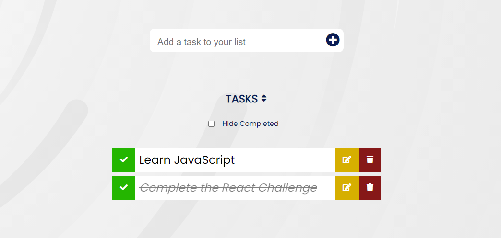

# TODO List App 📝
This is a front-end web application that consists of providing to its users a bunch of different ways to allow them to better organise their bare hand's tasks by always having an updatable TODO task list.

## Final Result
<p align="center">

</p>

## User Interaction/Requirements

* **Creating a task** – The user writes the task on an input text field and clicks the “Create” button. The task is then added to the list and marked as incomplete.
* **Marking a task as complete/incomplete** – The user clicks the checkbox on the left of the list entry, which toggles its state. 
* **Editing a task** – Clicking the “Edit” link on the right side of the list entry should allow the task name to be edited. You can display an input text field in-place, or re-use the task creation form.
* **Deleting a task** – Clicking the “Delete” link on the right side of the list entry should delete the entry.
* **Filtering the list** – Toggling the “Hide completed” checkbox on the bottom of the list should filter the completed entries from the list.
* **Sorting the list** – Clicking the “Tasks” list header should sort the list alphabetically from A to Z, clicking it again should change the order from Z to A, and a third time return to the default sorting (by creation date).

## Bonus included

```
LocalStorage
```
```
CSS Animations
```
